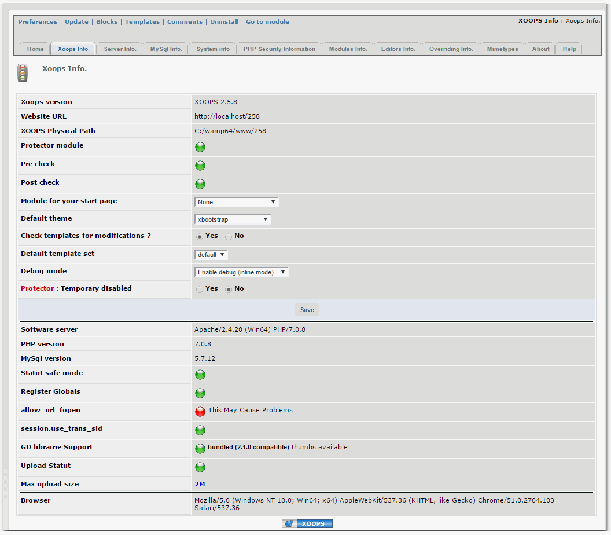
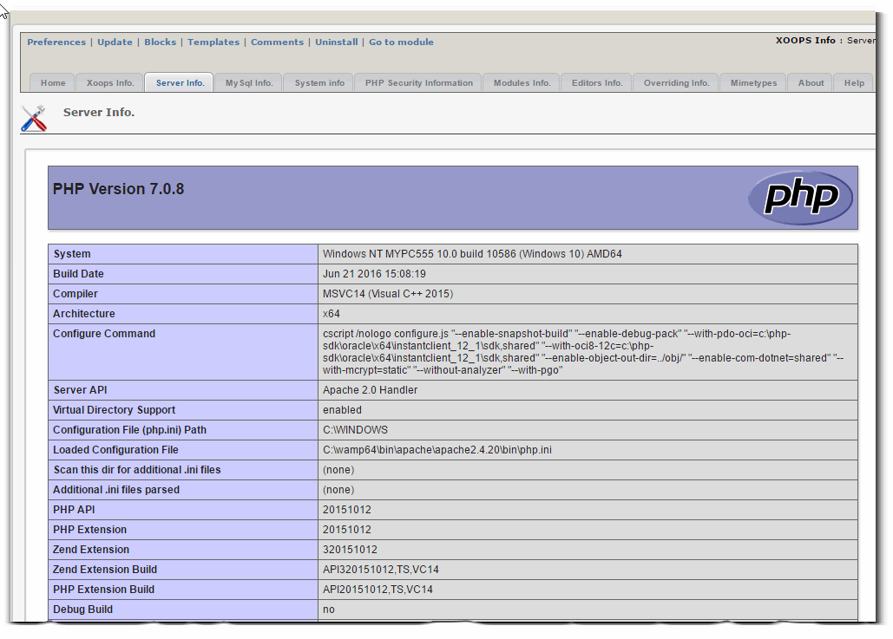
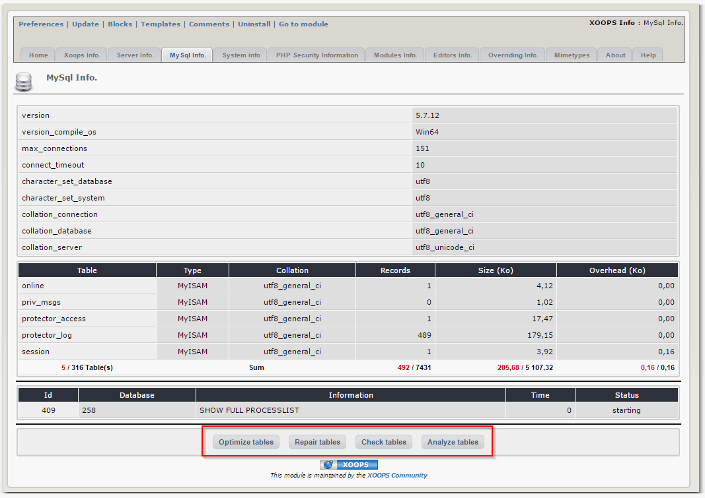
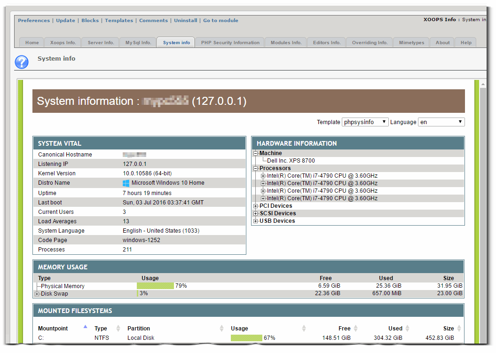
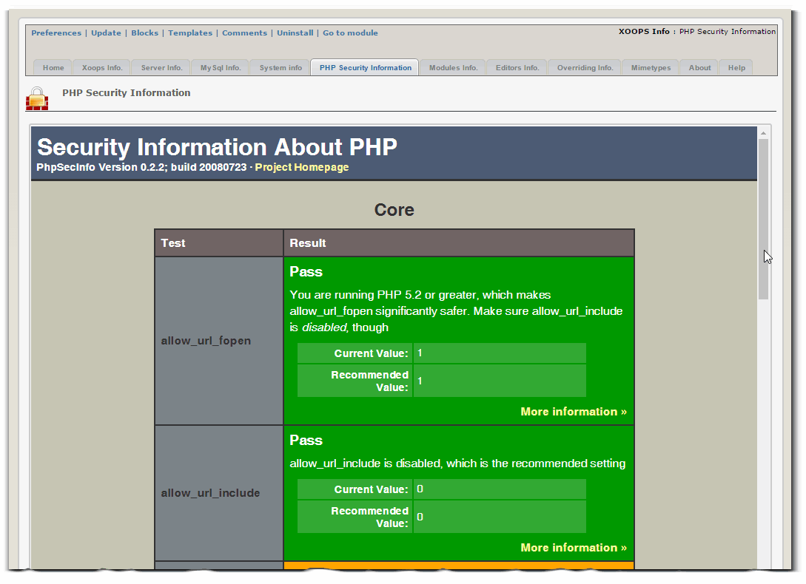
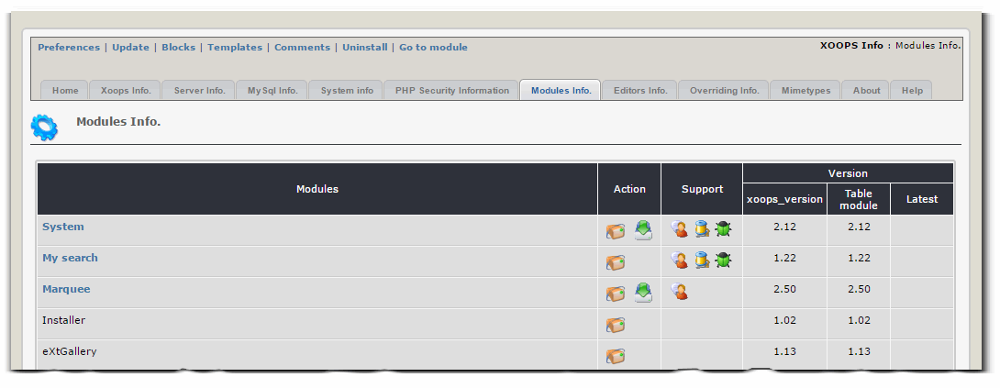
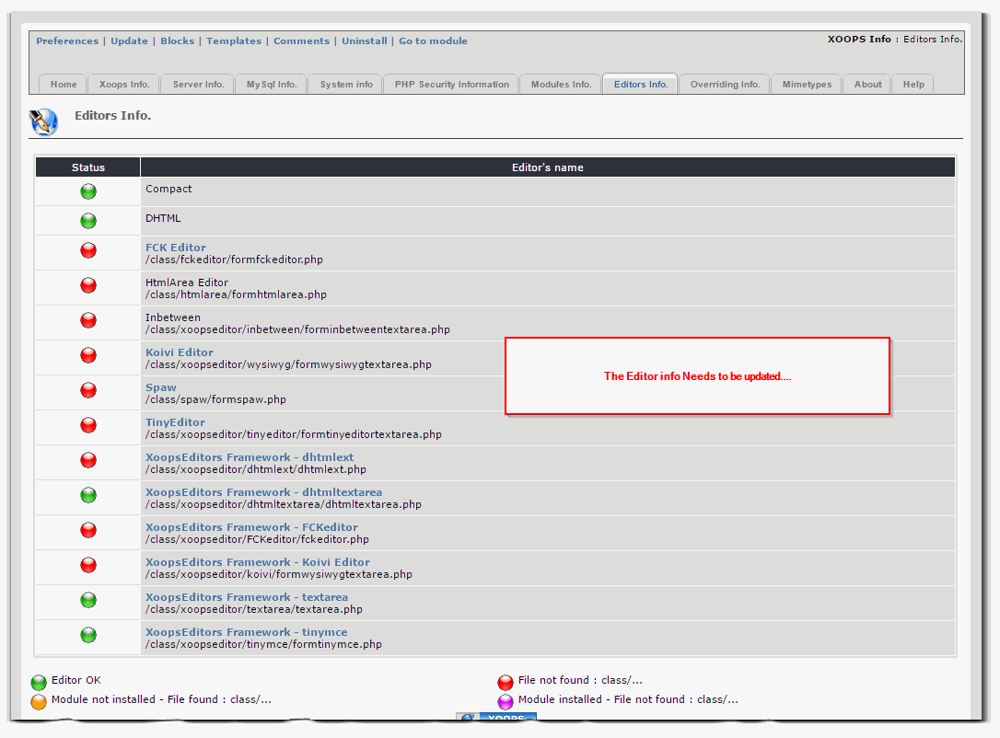
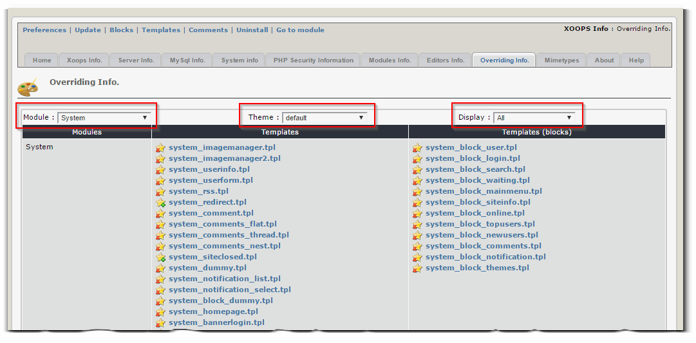
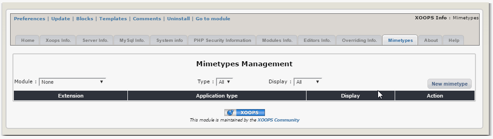
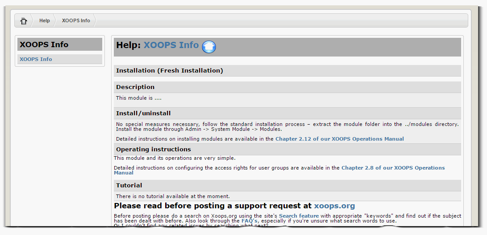

# Administration Menu


Let's go and review the individual Tabs:



Basic information about your XOOPS installation. This is also included in the Admin Control Panel.



PHP Information, comes from the standard PhpInfo call.



MySQL database info



**phpSysInfo** is a customizable PHP script that displays very nicely information about your system.  
The script comes from: [https://github.com/phpsysinfo/phpsysinfo](https://github.com/phpsysinfo/phpsysinfo), and is constantly updated!



**PhpSecInfo** provides an equivalent to the phpinfo\(\) function that reports security information about the PHP environment, and offers suggestions for improvement. The script comes from [https://github.com/funkatron/phpsecinfo](https://github.com/funkatron/phpsecinfo), but unfortunately, it was not updated for many years, so the information is definitely outdated. Slighty newer version is on: [https://github.com/robocoder/phpsecinfo](https://github.com/robocoder/phpsecinfo)



Overview of installed modules. In a specific file there is information about support for each of the modules, and how to submit bugs. This needs to be updated as it is right now fairly outdated.



List of available Edtitors. This needs to be updated.

 Overview of all templates used in XOOPS. This info is also available in XOOPS Admin under:



```text
YOUR_URL/modules/system/admin.php?fct=tplsets
```

 Information about Mimetypes supported by XOOPS. This needs to be updated.



 This Tab shows you the info about the module version, the developers, and the changelog.




If you need help, click on the Help tab, and there is some extra information

